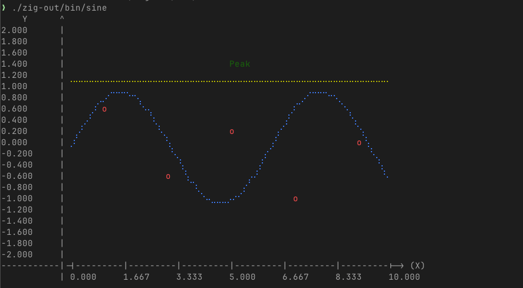
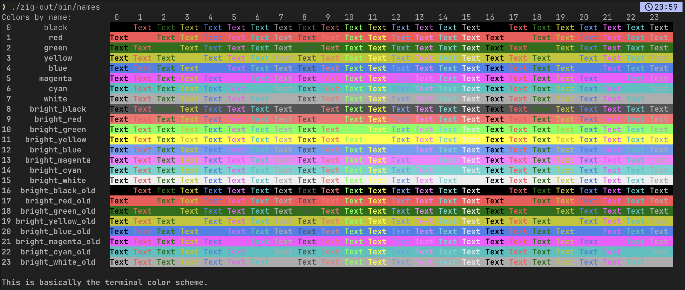
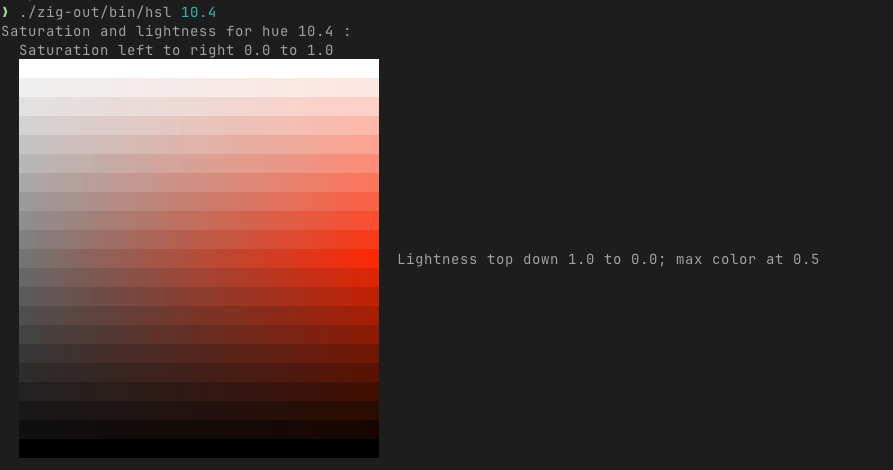
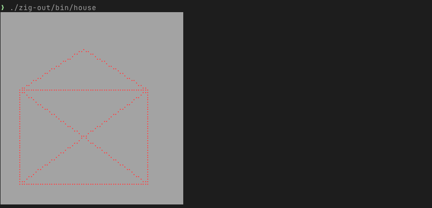
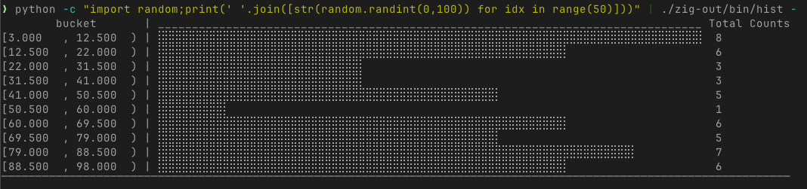
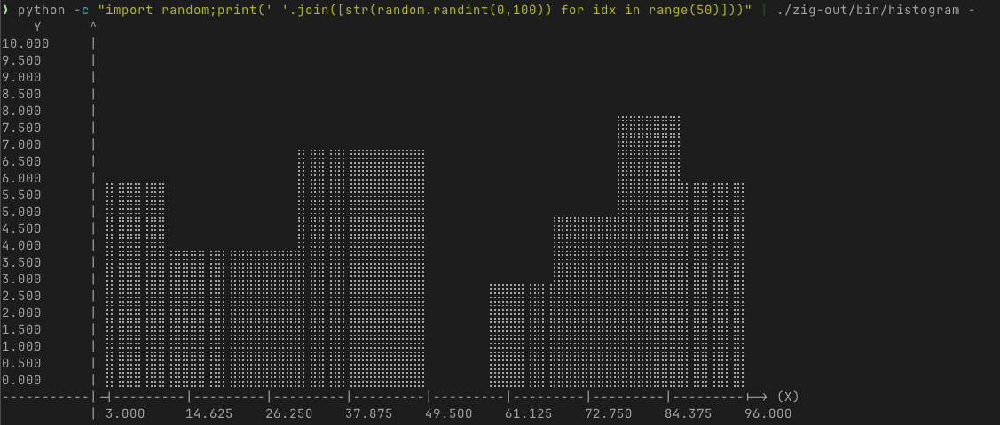
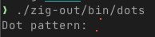

[](https://ziglang.org/download/0.15.2/release-notes.html)

# zig-plotille

Terminal plotting library for Zig with full C API support.

**Draw beautiful plots, histograms, and visualizations directly in your terminal using Unicode braille characters.**



## Features

- 🌈 **Rich Color Support**: ANSI, 8-bit, and 24-bit true color support
- 🎨 **Canvas Drawing**: General purpose braille dot canvas for custom graphics
- 📊 **Multiple Plot Types**: Line plots, scatter plots, histograms, text annotations
- 📐 **Flexible Layouts**: Support for axis lines, spans, and custom coordinate systems
- 🔧 **Dual API**: Native Zig API and complete C API for interoperability
- 🖥️ **Terminal Detection**: Automatic terminal capability detection
- 📏 **High Resolution**: 2×4 dots per character cell using Unicode braille patterns

Re-implementation of the Python [plotille](https://github.com/tammoippen/plotille) library with enhanced performance and C compatibility.

## Quick Start

### Building

```bash
# Build the library (creates both static and dynamic libraries)
zig build

# Build optimized release libraries
zig build -Doptimize=ReleaseFast
zig build -Doptimize=ReleaseSmall
zig build -Doptimize=ReleaseSafe

# Build with debug symbols stripped
zig build -Dstrip=true

# Build for specific target
zig build -Dtarget=x86_64-linux-gnu
zig build -Dtarget=aarch64-macos

# Build release library for distribution
zig build -Doptimize=ReleaseFast -Dstrip=true

# Run tests
zig build test

# Output will be in:
# - zig-out/lib/libplotille.a (static library, Linux/macOS)
# - zig-out/lib/plotille.lib  (static library, Windows)
# - zig-out/lib/libplotille.so (dynamic library, Linux)
# - zig-out/lib/libplotille.dylib (dynamic library, macOS)
# - zig-out/lib/plotille.dll  (dynamic library, Windows)
```

## Examples

In `zig-examples`, there are several examples demonstrating the library's capabilities. To build and run these examples, navigate to the `zig-examples` directory and execute the following commands:

```bash
# Build all examples and run all examples
zig build run

# Output will be in:
# - zig-out/bin/dots (executable)
# - zig-out/bin/hist (executable)
# - zig-out/bin/house (executable)
# - zig-out/bin/hsl (executable)
# - zig-out/bin/lookup (executable)
# - zig-out/bin/names (executable)
# - zig-out/bin/sine (executable)
# - zig-out/bin/terminfo (executable)
```

### Color Showcase

Display all available named colors in a grid:

```zig
const plt = @import("plotille");

// Detect terminal capabilities
// ALWAYS required, before printing with color support
// (either set or detect)
try plt.terminfo.TermInfo.detect(allocator);

// Display color grid
for (std.enums.values(plt.color.ColorName)) |bg_value| {
    const bg = plt.color.Color.by_name(bg_value);
    for (std.enums.values(plt.color.ColorName)) |fg_value| {
        const fg = plt.color.Color.by_name(fg_value);
        try plt.color.colorPrint(writer, "Text ", .{}, .{ .fg = fg, .bg = bg });
    }
}
```



(see [names.zig](zig-examples/names.zig) for more details and edge cases)

### HSL Color Space

Explore HSL color gradients:

```zig
const plt = @import("plotille");

// Create HSL color and display
const hue = 240.0; // Blue hue
for (0..20) |row| {
    for (0..40) |col| {
        const saturation = @as(f64, @floatFromInt(col)) / 40.0;
        const lightness = @as(f64, @floatFromInt(20 - row)) / 20.0;
        const color = plt.color.Color.by_hsl(hue, saturation, lightness);
        try plt.color.colorPrint(writer, " ", .{}, .{ .bg = color });
    }
    try writer.print("\n  ", .{});
}
```



(see [hsl.zig](zig-examples/hsl.zig) for more details)

### Canvas Drawing

Create custom graphics with the canvas API:

```zig
const plt = @import("plotille");

var canvas = try plt.canvas.Canvas.init(allocator, 40, 20, plt.color.Color.by_name(.white));
defer canvas.deinit(allocator);

// Draw a house
try canvas.rect(.{ .x = 0.1, .y = 0.1 }, .{ .x = 0.8, .y = 0.6 }, plt.color.Color.by_name(.red), null);
try canvas.line(.{ .x = 0.1, .y = 0.1 }, .{ .x = 0.8, .y = 0.6 }, plt.color.Color.by_name(.red), null);
try canvas.line(.{ .x = 0.8, .y = 0.1 }, .{ .x = 0.1, .y = 0.6 }, plt.color.Color.by_name(.red), null);

// Draw roof
try canvas.line(.{ .x = 0.1, .y = 0.6 }, .{ .x = 0.45, .y = 0.8 }, plt.color.Color.by_name(.red), null);
try canvas.line(.{ .x = 0.8, .y = 0.6 }, .{ .x = 0.45, .y = 0.8 }, plt.color.Color.by_name(.red), null);

try writer.print("{f}\n", .{canvas});
```



(see [house.zig](zig-examples/house.zig) for more details)

### Scientific Plotting

Create _publication-ready_ (if you plan to publish in terminal 😇) plots with the Figure API:

```zig
var fig = try plt.figure.Figure.init(allocator, 60, 20, null);
defer fig.deinit();

// Configure the plot
fig.xmin = 0;
fig.xmax = 10;
fig.ymin = -2;
fig.ymax = 2;

// Generate sine wave data
var x_data: [100]f64 = undefined;
var y_data: [100]f64 = undefined;
for (0..100) |i| {
    x_data[i] = @as(f64, @floatFromInt(i)) * 10.0 / 99.0;
    y_data[i] = @sin(x_data[i]);
}

// Add plots
try fig.plot(&x_data, &y_data, .{ .lc = plt.color.Color.by_name(.blue), .label = "sin(x)" });

// Add scatter points
const points_x = [_]f64{ 1, 3, 5, 7, 9 };
const points_y = [_]f64{ 0.8, -0.5, 0.2, -0.9, 0.1 };
try fig.scatter(&points_x, &points_y, .{ .lc = plt.color.Color.by_name(.red), .label = "data", .marker = 'o' });

// Add annotations
try fig.text(5, 1.5, "Peak", plt.color.Color.by_name(.green));
try fig.axhline(0.8, .{ .lc = plt.color.Color.by_name(.yellow) });

try fig.prepare();
try writer.print("{f}\n", .{fig});
```


(see [sine.zig](zig-examples/sine.zig) for more details)

### Histograms

Visualize data distributions. Either using Histogram directly:

```zig
const plt = @import("plotille");

const data = [_]f64{ 1.2, 2.3, 1.8, 2.1, 1.9, 2.4, 1.7, 2.0, 1.6, 2.2 };
var hist = try plt.hist.Histogram.init(allocator, &data, 5);
defer hist.deinit(allocator);

try writer.print("{f}\n", .{hist});
```



(see [hist.zig](zig-examples/hist.zig) for more details)

OR using a Figure with a histogram:

```zig
const plt = @import("plotille");

const data = [_]f64{ 1.2, 2.3, 1.8, 2.1, 1.9, 2.4, 1.7, 2.0, 1.6, 2.2 };

var fig = try plt.figure.Figure.init(allocator, 80, 20, null);
defer fig.deinit();

// Configure the plot
fig.xmin, fig.xmax = std.mem.minMax(f64, values.items);
fig.ymin = 0;
fig.ymax = 12;

try fig.histogram(values.items, 10, null);

try fig.prepare();
try writer.print("{f}\n", .{fig});
```



(see [histogram.zig](zig-examples/histogram.zig) for more details)

### Individual Braille Dots

Low-level control with the Dots API:

```zig
const plt = @import("plotille");

var dot = plt.dots.Dots{};
dot.set(0, 0); // Top-left
dot.set(1, 3); // Bottom-right
dot.color.fg = plt.color.Color.by_name(.red);

try writer.print("Dot pattern: {f}\n", .{dot});
```



(see [dots.zig](zig-examples/dots.zig) for more details)

## API Overview

### Core Modules

- **`plotille.canvas`**: Low-level canvas for drawing points, lines, rectangles
- **`plotille.figure`**: High-level plotting interface with legends and axes
- **`plotille.hist`**: Histogram generation and rendering
- **`plotille.dots`**: Individual braille character manipulation
- **`plotille.color`**: Comprehensive color support (names, RGB, HSL, 8-bit)
- **`plotille.terminfo`**: Terminal capability detection

### Canvas API

```zig
// Create canvas
var canvas = try plt.canvas.Canvas.init(allocator, width, height, bg_color);
defer canvas.deinit(allocator);

// Set coordinate system
canvas.setReferenceSystem(xmin, ymin, xmax, ymax);

// Drawing operations
canvas.point(.{ .x = 0.5, .y = 0.5 }, color, 'X');
try canvas.line(.{ .x = 0, .y = 0 }, .{ .x = 1, .y = 1 }, color, null);
try canvas.rect(.{ .x = 0.2, .y = 0.2 }, .{ .x = 0.8, .y = 0.8 }, color, null);
canvas.text(.{ .x = 0.5, .y = 0.9 }, "Label", color);
```

### Figure API

```zig
// Create figure
var fig = try plt.figure.Figure.init(allocator, width, height, bg_color);
defer fig.deinit();

// Add data series
try fig.plot(x_data, y_data, .{ .lc = color, .label = "Series 1" });
try fig.scatter(x_data, y_data, .{ .lc = color, .marker = 'o' });
try fig.histogram(data, bins, color);

// Add annotations
try fig.text(x, y, "Note", color);
// all ax* methods take relative coordinates for x and y
try fig.axvline(x_pos, .{ .lc = color });
try fig.axhline(y_pos, .{ .lc = color });
try fig.axvspan(x_min, x_max, .{ .lc = color });
try fig.axhspan(y_min, y_max, .{ .lc = color });

// Render
try fig.prepare();
```

### Color System

```zig
// Named colors
const red = plt.color.Color.by_name(.red);

// RGB colors
const custom = plt.color.Color.by_rgb(255, 128, 0);

// HSL colors
const hsl = plt.color.Color.by_hsl(240, 1.0, 0.5);

// 8-bit palette
const indexed = plt.color.Color.by_lookup(196);

// Print with color
try plt.color.colorPrint(writer, "Colored text", .{}, .{ .fg = red, .bg = indexed });
```

## C API

For C/C++ integration, include `plotille.h` and link against the appropriate library for your platform (`libplotille.a` / `plotille.lib` for static, `libplotille.so` / `libplotille.dylib` / `plotille.dll` for dynamic):

```c
#include "plotille.h"

// C API mirrors the Zig API
Canvas canvas;
canvas_init(40, 20, color_no_color(), &canvas);
canvas_set_reference_system(&canvas, 0.0, 0.0, 1.0, 1.0);

Point p = {0.5, 0.5};
canvas_point(&canvas, p, color_by_name(COLOR_RED), 0);

uint8_t buffer[4096];
size_t len = canvas_str(canvas, buffer, sizeof(buffer));
printf("%.*s\n", (int)len, buffer);

canvas_free(&canvas);
```

See `plotille.h` for the complete C API documentation and the `c-examples/` directory for usage examples.

## Coordinate System

- **Canvas Resolution**: Each character represents 2×4 braille dots
- **Reference System**: Floating-point coordinates (default: 0,0 to 1,1)
- **Automatic Scaling**: Coordinates are automatically mapped to canvas dimensions
- **Origin**: Bottom-left (0,0) to top-right (max,max)

## Terminal Support

The library automatically detects terminal capabilities:

- **True Color**: 24-bit RGB support
- **8-bit Color**: 256-color palette
- **Named Colors**: Basic 16-color ANSI
- **No Color**: Monochrome fallback

Respects `NO_COLOR` and `FORCE_COLOR` environment variables.

## Building and Integration

### As a Zig Module

Add to your `build.zig.zon`:

```bash
zig fetch --save git+https://github.com/tammoippen/zig-plotille
```

Then add the module to your `build.zig`:

```zig
const plotille = b.dependency("plotille", .{
    .target = target,
    .optimize = mode,
});
```

### As a C Library

```bash
# Build libraries (both static and dynamic)
zig build

# Build optimized release libraries for distribution
zig build -Doptimize=ReleaseFast -Dstrip=true

# Output libraries:
# - zig-out/lib/libplotille.a / plotille.lib (static library)
# - zig-out/lib/libplotille.so/.dylib / plotille.dll (dynamic library)

# Include plotille.h in your C/C++ project
#
# See Makefile for build instructions
```

## Examples and Tests

- **`src/*.zig`**: Unit tests demonstrating all features
- **`zig-examples/`**: Complete Zig example programs
- **`examples/dots.c`**: C API usage example

Run all examples: `make test`
